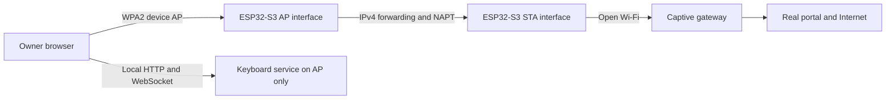

# Captive Portal Pass-Through Proposal

Date: 2026-09-16
Status: draft for discussion; not implemented or approved for device installation.

This change adds this proposal and a link in the
[documentation index](../README.md#documentation). It does not change firmware,
network configuration, packaging, or CI, and it does not authorize a device
write. The existing [Wi-Fi implementation record](wifi-enhancement-plan.md)
deliberately limits station mode to WPA2-Personal networks; this document
proposes a separate, later increment.

## Decision Summary

Allow an authenticated owner to use a browser through the keyboard's protected
access point to complete sign-in on an upstream open network. The ESP32-S3 stays
in AP+STA mode and performs transparent IPv4 Network Address and Port Translation
(NAPT), so the captive network sees traffic using the board's station MAC and IP.

Do not download, rewrite, store, or locally serve a copy of the captive portal.
The client must load the real portal through the board. This preserves normal
HTTP redirects and end-to-end HTTPS and supports portal JavaScript, cookies,
external identity providers, MFA, and CAPTCHA without teaching the firmware how
to parse or automate them.

The first proof of concept should use the upstream DNS server received by the
station DHCP client and advertise it to newly connected AP clients. Before a
release, either prove that DNS changes and lease renewal are reliable across the
supported client matrix or add a bounded DNS forwarder at the board's AP address.

This feature is best-effort compatibility, not universal captive-portal support.
Networks may reject NAPT, require 802.1X or a managed application, bind access to
browser state instead of the station identity, or prohibit connection sharing.

## Goal And Scope

The goal is to support this owner journey:

1. Connect a phone or laptop to the keyboard's password-protected AP.
2. Select an open 2.4 GHz upstream SSID in the authenticated Network view.
3. Keep the protected AP active while the board associates as a station.
4. Route the client's real browser session through the board to the captive
   portal.
5. Let the owner enter portal information directly into that portal.
6. Detect when upstream access becomes available and retain the protected AP as
   the keyboard's control path.

The proposed first increment includes:

- One explicitly selected open upstream SSID and a persistent portal-router
  mode.
- A password-protected device AP with at most one associated client.
- IPv4 forwarding and NAPT from the device AP to the station interface.
- DNS service suitable for browser portal discovery and external dependencies.
- An advisory connectivity state and a full-browser handoff flow.
- Strict separation between the trusted AP control service and the untrusted
  upstream station link.
- Existing candidate-profile atomicity, owner authentication, input release,
  recovery, and direct-IP access guarantees.

Defer WPA-Enterprise/802.1X, WEP, 5 GHz, multiple saved networks, IPv6
translation, inbound port mapping, TLS interception, portal-specific form
automation, credential storage, MAC spoofing, portal-session renewal, and use as
a general-purpose travel router. A later increment may allow portal-router mode
on a password-protected upstream network, but the first increment targets open
networks only.

## Baseline And Feasibility

The current implementation already has most of the control-plane foundation but
intentionally rejects open upstream networks:

| Area | Current behavior | Required change |
| --- | --- | --- |
| Network profile | Requires an SSID and an 8-63 byte WPA2 password. | Add an explicit open-network security type; do not infer it only from an empty password. |
| Station security | Requires WPA2 or WPA/WPA2 association. | Require `WIFI_AUTH_OPEN` exactly for an open candidate and retain the existing protected-network checks. |
| AP+STA lifecycle | Uses AP+STA temporarily for candidate testing and recovery, then normally closes the AP. | Add a durable portal-router mode that deliberately keeps both interfaces active. |
| DHCP and DNS | The device AP provides DHCP; no upstream DNS-routing contract exists. | Advertise a working upstream resolver or the address of a bounded local forwarder. |
| Packet routing | lwIP IP forwarding and NAPT are disabled. | Enable the two build features with a default-deny, per-mode forwarding policy; allow NAPT transit only for an authorized portal-router client. |
| Service exposure | The web application can operate over AP or normal STA paths. | In portal-router mode, accept keyboard and management service traffic only through the protected AP. |

ESP-IDF 6.1 supports this architecture on ESP32-S3. Its public
`esp_netif_napt_enable()` API enables NAPT on one interface, and the supplied
`wifi/softap_sta` example configures the station as the default route, copies the
station DNS server into the AP DHCP offer, and enables NAPT on the AP interface.
The required build settings are:

```ini
CONFIG_LWIP_IP_FORWARD=y
CONFIG_LWIP_IPV4_NAPT=y
CONFIG_LWIP_IPV4_NAPT_PORTMAP=n
```

Port mapping is unnecessary and should be explicitly disabled. The project
currently has DHCP-server support but does not enable IP forwarding or NAPT.
These build options enable forwarding globally; disabling NAPT does not disable
untranslated forwarding. The bidirectional policy below is required in every
mode, including existing AP+STA candidate testing and recovery.
The board has one Wi-Fi radio, so its AP follows the station channel and scans,
association, and upstream channel changes can briefly disrupt AP clients.

This feasibility finding establishes API availability, not product acceptance.
Memory, throughput, channel changes, captive-network behavior, and forwarding
isolation still require controlled and physical tests. The current build does
not enable PSRAM; this increment must not require it unless measurements lead to
a separately reviewed board-profile change.

## Related Work And Lessons

Research on 2026-09-16 found substantial prior art for the routing data path but
no maintained reference that demonstrates a reliable, generic upstream captive-
portal workflow with this product's security boundaries:

| Reference | What it demonstrates | What it does not establish |
| --- | --- | --- |
| [ESP-IDF 6.1 SoftAP+STA example](https://github.com/espressif/esp-idf/tree/v6.1/examples/wifi/softap_sta) | Official ESP32-S3 AP+STA support, station default routing, public `esp_netif_napt_enable()`, and propagation of station DNS through the AP DHCP offer. | Portal detection, browser handoff, reconnect behavior, or service isolation. |
| [ESP-IoT-Bridge Wi-Fi Router](https://github.com/espressif/esp-iot-bridge/tree/master/examples/wifi_router) | A maintained Espressif component and ESP32-S3 example for SoftAP-to-station NAPT, DHCP/DNS updates, subnet-conflict handling, and web/BLE provisioning. | Explicit open-network portal login, portal-state reporting, or AP-only exposure of a USB-control service. |
| [ESP32 NAT Router](https://github.com/martin-ger/esp32_nat_router) | A mature AP-to-STA router with NAPT, upstream DNS propagation, reconnect handling, firewall hooks, and broad deployment history. Its maintainer states in [issue #79](https://github.com/martin-ger/esp32_nat_router/issues/79) that the first downstream client should receive an upstream portal. | A universal success claim: [issue #73](https://github.com/martin-ger/esp32_nat_router/issues/73) reports that the portal did not appear through the ESP32 router even though the same scenario worked for that user with the ESP8266 predecessor. |
| [ESP32 NAT Router Extended](https://github.com/dchristl/esp32_nat_router_extended) | Open upstream selection using a blank station password, persistent AP+STA NAPT, upstream DNS propagation, and public-Wi-Fi-oriented operation. | Its documented captive portal primarily redirects to the router's own configuration page; that is different from passing through an upstream portal. |
| [ESP8266 Wi-Fi Repeater](https://github.com/martin-ger/esp_wifi_repeater) | Open upstream networks, NAPT, and upstream-provided DNS. The reporter in ESP32 NAT Router issue #73 says real portal pass-through worked with this predecessor. | ESP32-S3 or ESP-IDF 6.1 behavior; the portal result is an anecdotal report rather than a compatibility matrix. |
| [Community Wi-Fi Repeater](https://github.com/benjaminchazelle/Community-WiFi-repeater) | An explicit attempt to join FreeWifi and SFR/FON networks, probe Firefox's portal-detection endpoint, and parse the provider redirect. | A finished authentication implementation: the provider-specific authentication states remain incomplete, and the project has no current maintenance evidence. |

These references make the basic NAPT/DHCP/DNS path low architectural risk, but
they disprove the stronger assumption that enabling NAPT automatically produces
a dependable portal popup. Client lease timing, cached DNS configuration, OS
connectivity-check behavior, portal allowlists, HTTPS/HSTS, and the gateway's
authorization model can each change the result. A manual full-browser entry
point must remain available even when the operating system does not open its
portal assistant.

Use the public ESP-IDF 6.1 `esp_netif` APIs in the existing network component,
with ESP-IoT-Bridge and the official example as implementation references. Do
not import a complete router firmware or copy older private
`ip_napt_enable()`-based integration into this product. The other projects have
different persistence, credential-logging, local-service, firewall, update, and
recovery contracts and therefore provide test ideas rather than product safety
evidence. No source reuse is proposed; any later reuse requires a separate
license and security review.

## Selected Architecture



The board is a small layer-3 router, not a layer-2 bridge and not an HTTP reverse
proxy. It does not bridge broadcasts, reflect mDNS, or expose the AP subnet to
the upstream network.

Traffic has four distinct paths:

| Traffic | Handling |
| --- | --- |
| Client to board AP address | Terminate locally for the authenticated keyboard and Network UI; never send it upstream. |
| Authorized client to external IPv4 address | Forward AP to STA with source address and port translated to the board's station identity. |
| Reply to an established translation | Translate and return only to the originating, still-authorized AP client. |
| Unsolicited station-side traffic | Drop before it can reach the AP client or local keyboard service. |

Do not assume that address translation alone is a complete firewall. Install a
default-deny forwarding policy before either interface can carry transit:

| Runtime state | AP-to-STA transit | STA-to-AP transit |
| --- | --- | --- |
| Standalone AP or Personal STA, including candidate testing and recovery | Drop, even while both interfaces are up. | Drop, including directly addressed AP-subnet packets. |
| Startup, transition, partial failure, or portal router without a current transit authorization | Drop. | Drop, including replies to any stale translation. |
| Portal router with a valid lease, configured DNS, and current transit authorization, during path validation or ready operation | Permit only the authorized AP association and its current IPv4 lease through NAPT; reject spoofed sources and untranslated transit. | Permit only replies matching translations owned by that same authorization generation; drop everything else. |

Close both forwarding directions before changing mode, lease, authorization,
NAPT, or DNS state. If policy installation or cleanup cannot be verified, leave
transit blocked; NAPT being disabled is not the safety boundary. Local AP
management, DHCP, and optional DNS service are separately permitted, not routed.
Board-originated station DHCP, DNS, and advisory probes are not AP-client transit
and need their own bounded, mode-scoped egress policy. Release acceptance requires
packet-level evidence for both directions in every state and injected failure.

The portal normally observes the board's stable station MAC and current DHCP
lease address. Only the MAC is intended to remain stable; an address change
invalidates translations and may require portal reauthorization. The browser's HTTP properties and
cookies remain those of the real client. This works when the gateway grants
network access to the station MAC/IP after browser sign-in; it may not work when
the portal grants access only to a browser cookie or actively detects and blocks
connection sharing.

## Why Portal Mirroring Is Not Selected

Saving a portal into a local directory and serving it from the board would turn
the firmware into a content scraper and reverse proxy. That approach is both
less compatible and less secure:

- Portal pages commonly contain expiring CSRF tokens, cookies, generated forms,
  absolute URLs, and redirects tied to the current network session.
- JavaScript modules, API calls, CSP, service workers, OAuth, CAPTCHA, and MFA
  cannot be reproduced reliably by copying static files.
- HTTPS pages cannot be transparently rewritten without terminating TLS and
  presenting an untrusted certificate or installing a new trust root.
- Collecting forms would put portal credentials and personal information inside
  the board's application, logs, memory-management paths, and threat model.
- Every portal variation would become a firmware compatibility and maintenance
  burden.

With transparent routing, TLS remains end-to-end between the owner's browser and
the real portal. The board forwards packets and keeps only bounded translation
and optional DNS transaction state. It must not log payloads, form fields,
cookies, authorization headers, redirect query strings, or DNS answers.

## Network Model And Persistence

Replace the persisted station boolean with an explicit versioned mode while
preserving the existing one-profile limit:

| Mode | Device AP | Station | NAPT | Normal control path |
| --- | --- | --- | --- | --- |
| Standalone AP | On | Off | Off | Device AP |
| Personal STA | Temporary during testing/recovery | WPA2 station | Off | Station after confirmed handover |
| Portal router | Always on | Open station | On only during authorized path validation or ready operation, after a valid IPv4 lease and DNS configuration | Device AP only |

The next configuration schema should store mode, SSID bytes, requested hostname,
upstream security type, and a password only when the type requires one. Migrate
valid version-1 records to Personal STA or Standalone AP without changing their
meaning. Unknown modes and malformed combinations fail closed into the protected
recovery AP without erasing the prior record.

Persisting portal-router mode authorizes restoring the upstream profile, not
restoring client transit. Transit authorization, association/lease bindings,
NAPT entries, and DNS transactions are runtime-only and start empty after reboot.

Use an explicit portal-network action rather than treating every blank password
as permission to join an open network. For scan results, show the observed
security type and require owner confirmation. For a hidden open SSID, require an
explicit Open selection. At association time verify that the actual network is
`WIFI_AUTH_OPEN`; do not silently accept a protected-to-open downgrade or a
different SSID representation.

Keep the board's station MAC stable across reconnects and reboot. Do not clone
the client MAC, rotate it while a portal grant may be active, or expose controls
for arbitrary spoofing. A portal grant may expire independently of the saved
network profile; expiration must not erase that profile.

Candidate testing remains atomic. Association and DHCP prove that the open
network configuration is usable, but they do not prove Internet authorization.
Commit portal-router mode only after the owner explicitly accepts the selected
network and the AP recovery path remains available. Switching modes or forgetting
the profile uses the existing guarded storage pattern and releases active input.

## NAPT Lifecycle

NAPT belongs to portal-router runtime state, not merely to AP+STA mode. Use the
public `esp_netif` API rather than private lwIP calls.

After the station receives a valid IPv4 lease:

1. Keep both forwarding directions blocked, disarm affected control paths, and
  verify that the AP and station subnets do not overlap.
2. Select the station interface as the default route.
3. Configure the IPv4 resolver and AP DHCP DNS offer or local forwarder. This is
  DNS configuration, not proof that AP-client DNS works. Complete any required
  AP-client lease renewal before the next step.
4. Obtain fresh owner transit authorization for the current AP association and
  IPv4 lease. Install its generation-bound forwarding policy and enable NAPT on
  the AP interface with `esp_netif_napt_enable()`; on either failure, close both
  directions and clean up.
5. Verify the AP-client DNS path through the now-enabled data path, then mark
  DNS and routing ready. Forwarding during this validation is already authorized;
  `routing_ready` must not be a prerequisite for the DNS test itself.

On station address loss, station or AP-client disconnect, mode change, AP
renumbering, authorization loss, or routing failure:

1. Block both forwarding directions and mark transit unavailable immediately.
2. Revoke the transit authorization and disable NAPT. Clear all translations
  before any new client or authorization generation can use the data path.
  Verify the selected public-API cleanup sequence actually empties the table;
  do not assume that disabling NAPT alone flushes it.
3. Cancel DNS transactions and late callbacks from the old generation. Clear
  upstream DNS configuration when the station lease or resolver is invalid, and
  clear the advisory portal result.
4. Keep the protected AP and local keyboard service available when their own
   state remains healthy.
5. Retry a lost upstream connection with bounded backoff. A healthy station lease
  may remain after AP-client disconnect, but translations, DNS transactions, and
  client authorization must not. Re-enable transit only through the setup
  sequence with a valid station lease, DNS configuration, and fresh owner grant.

Do not forward IPv6 or advertise an IPv6 router in the first increment. Do not
add NAPT port mappings. Keep the current single AP-client limit. Bound and
measure NAPT table memory, active entries, forced eviction, heap headroom, and
packet loss under a realistic portal with many parallel asset requests.

## DNS Strategy

Captive portals often depend on the network-provided resolver for redirect or
walled-garden behavior. A fixed public resolver is therefore not an acceptable
default.

### Stage A: Advertise Upstream DNS

For the proof of concept, follow the ESP-IDF SoftAP+STA example:

1. Read the main station DNS server after IPv4 DHCP completes and require a
  usable, nonzero unicast IPv4 resolver reachable through the station. Missing
  DNS or an IPv6-only resolver leaves DNS unavailable and transit disabled.
2. Stop the AP DHCP server long enough to update its DNS option.
3. Set the AP interface DNS information and enable the DHCP DNS offer.
4. Restart the AP DHCP server.
5. Require the AP client to reconnect or renew its lease, then obtain its fresh
  owner transit authorization and enable the data path before verifying DNS.

DNS requests then traverse NAPT as ordinary UDP or TCP traffic. Repeat the setup
after station lease or resolver changes using the closed-transit lifecycle above.
An already leased client is not assumed
to learn a changed DNS option merely because the DHCP server restarted.

This stage is intentionally small and directly falsifiable: if a supported
phone reconnects, receives the upstream resolver, resolves the portal and its
dependencies, and completes sign-in through NAPT, no DNS proxy is needed for
the architectural proof.

### Stage B: Stable Local DNS Forwarder

If reconnecting or lease renewal is not reliable enough for the product flow,
advertise the board's AP address as DNS from the initial lease and run a bounded
forwarder there. It can return a temporary failure before station DNS is ready
and begin forwarding without forcing the client to obtain a new lease.

Before writing a new parser, evaluate a maintained ESP-IDF-compatible component.
Any forwarder selected or implemented here must:

- Bind only to the protected AP path and reject station-side clients.
- Forward to the same validated IPv4 resolver learned through station DHCP and
  replace it after a lease change; IPv6-only DNS remains unavailable. The
  forwarder's upstream sockets originate on the board and use the station route,
  not AP-client NAPT. Client-facing DNS still requires the current transit grant.
- Support UDP and the TCP fallback required for truncated DNS responses.
- Preserve queries and responses without synthesizing portal answers.
- Use bounded transaction state, randomized upstream identifiers or source
  ports, short deadlines, and strict response-source matching. Bind transactions
  to the authorized AP association/lease generation and discard them on revoke.
- Handle malformed packets, duplicate identifiers, oversized messages, EDNS,
  exhaustion, and upstream loss without memory growth or blocking the network
  worker.
- Avoid persistent caching initially; never log full queries or responses.

The forwarder is not an open resolver and does not replace mDNS. `kb.local`
continues to use link-local mDNS on the protected AP, with the AP IP as the
reliable fallback. DNS-over-HTTPS traffic from the browser is ordinary NAPT
traffic; some captive networks may block it, and the firmware must not weaken
the browser's security settings to work around that policy.

## Portal Detection And Browser Handoff

Portal detection is advisory and must not become a prerequisite for local
keyboard operation. Association plus DHCP can produce these states:

| State | Meaning |
| --- | --- |
| `joining` | No stable station lease yet. |
| `routing` | Lease exists; DNS and NAPT are being established. |
| `login_required` | A connectivity probe received a redirect or unexpected portal response. |
| `authorized` | A fresh probe received its exact expected success response. |
| `limited` | DNS, timeout, policy, or unexpected response prevents a stronger conclusion. |
| `routing_failed` | Local forwarding could not be enabled; portal browsing is unavailable. |

Use a rate-limited plain-HTTP probe with an exact expected status and body so a
portal can redirect it. A build must not silently adopt a third-party tracking
endpoint. Before release, document the endpoint owner, request contents,
retention policy, expected response, timeout, retry rate, success lifetime, and
behavior when the endpoint is unavailable. Lab and automated tests use a controlled local probe.
If no acceptable production endpoint is available, leave status `limited` and
allow the owner to run the browser flow manually rather than making a false
authorization claim.

Every probe attempt sends a fresh unpredictable 128-bit nonce as an ephemeral
query parameter with request `Cache-Control: no-cache, no-store, max-age=0`.
Require response `Cache-Control: no-store` and an exact expected success body
that echoes that nonce. Never reuse a nonce across retries or log/persist it.
Accept success only once for the matching outstanding attempt, current
station/routing generation, and documented request deadline. A missing,
mismatched, expired, or replayed nonce yields `limited`, never `authorized`.
Expire the advisory success after its documented bounded lifetime and invalidate
it immediately on a routing-generation change. Plain HTTP remains untrusted;
freshness prevents cached-success replay, not deliberate gateway impersonation
or a gateway allowlisting only the probe destination.

Keep **Open network sign-in** available whenever the owner's local transit grant
and routing path permit it, including when the advisory state is `authorized`.
Probe success neither grants client transit nor proves arbitrary Internet access.

Do not fetch or store the redirected portal on behalf of the browser. The UI's
**Open network sign-in** command should navigate a new full-browser page to the
documented HTTP trigger URL through NAPT; the network then performs its own
redirect. A captive-network mini-browser may appear, but the product must not
depend on that OS behavior and must retain a direct route back to
the current protected-AP URL published by network status. `http://192.168.4.1/`
is only the normal default; AP renumbering must update the displayed recovery
and reconnect addresses.

The browser trigger is a separate contract from the board's advisory probe.
Before implementing the handoff command, select and document a product-controlled
plain-HTTP origin and path, endpoint owner, retention policy, expected response,
and outage behavior. The command opens that URL with a normal browser GET and
`noopener,noreferrer`, with no device identifier, owner token, or application-
supplied query parameters. The uncaptive endpoint must return a documented static
response with `Cache-Control: no-store`; captive redirects are followed by the
browser, never by the board. Tests use a controlled lab URL. Do not ship an
arbitrary third-party fallback or enable the command before this decision is
resolved; an unavailable trigger must not be reported as failed portal credentials.

After the owner completes sign-in, a manual **Check again** action and bounded
background probes can update the advisory state. Distinguish gateway-wide
authorization of the board's MAC/IP from browser-cookie-only access. A browser
may work while a board-origin probe remains captive; report that ambiguity as
`limited`, not as a definitive failure.

Portal expiration keeps the protected AP and NAPT path available for another
browser sign-in. It does not erase the profile, reboot the board, regenerate an
identity, or disable an otherwise healthy local keyboard path.

## Security And Privacy Boundaries

This device can inject keyboard input into a USB host, so enabling routing must
not weaken the existing control boundary.

- Require an authenticated owner session and explicit confirmation before
  joining an open network or enabling portal-router mode.
- Treat the AP credential as permission to associate, not permission to route.
  Require an explicit authenticated **Enable browser access** action on the AP
  path, bound to the requesting client's current Wi-Fi association generation,
  IPv4 lease, and owner-session generation. Enforce that binding at packet ingress,
  not merely by trusting a source IP. Revoke on AP disconnect, lease replacement,
  owner logout/session expiry, mode change, or reboot. A reconnect, even with the
  same MAC/IP or saved browser session, requires a fresh explicit grant; background
  polling never grants or extends transit authorization.
- Release and revoke keyboard control before network selection and portal
  handoff. Require a fresh **Take Control** after the owner returns to the
  keyboard page.
- Keep the per-device WPA2 AP password, owner authentication, CSRF/Origin/Host
  validation, session expiry, and controller lease rules unchanged.
- In portal-router mode, reject HTTP and WebSocket service requests received on
  the station interface, even when they contain a valid-looking session token.
  Apply this isolation before joining an open candidate and on saved-mode boot,
  not only after committing the candidate profile.
- Advertise the keyboard mDNS service only on the protected AP in this mode. Do
  not reflect mDNS, SSDP, broadcast, or multicast traffic across interfaces.
- Permit only established NAPT replies toward the AP. Do not enable a DMZ,
  UPnP, NAT-PMP, PCP, port mapping, or unsolicited station-to-AP forwarding.
- Keep local service packets local. Packet captures must show that keyboard
  HTTP/WebSocket traffic never exits through the open station link.
- Never terminate external TLS, install a CA, suppress browser certificate
  errors, rewrite portal content, or collect portal form submissions.
- Never persist portal pages, cookies, form fields, authorization headers, or
  personal information. Zero temporary probe buffers and redact URLs with query
  strings from logs and status.
- Bind any DNS forwarder to the AP path, rate-limit it, and exclude its traffic
  from verbose release logs.
- Explain that HTTP portal fields and metadata can be observed or modified on an
  open upstream network. The board cannot make an insecure portal secure.
- Make the owner acknowledge that network terms may prohibit routing or
  connection sharing. Do not add bypass behavior for such restrictions.

Compiling IP forwarding into lwIP broadens the network attack surface even when
portal mode is inactive. Runtime tests must prove that NAPT and forwarding are
off in Standalone AP and Personal STA modes, including AP+STA testing/recovery,
and after every partial failure. Test untranslated packets in both directions,
not just successful NAPT sessions. Association alone must never enable transit.

## Network Settings Experience

Extend the existing Network view rather than creating a second setup site:

- Label open scan results clearly as unsecured and distinguish them from
  unsupported enterprise or legacy-security networks.
- Offer an explicit **Use browser sign-in** action for a selected open network;
  do not show a password field for that action.
- Before connecting, explain that the protected device AP stays active and that
  Internet traffic from its one client will traverse the selected network only
  after explicit owner authorization. Show when browser access is disabled or
  expired, and require **Enable browser access** again after reconnect.
- Show association, station address, DNS readiness, routing readiness, portal
  state, last probe age, and bounded error codes without exposing portal URLs or
  payloads.
- Provide **Open network sign-in**, **Check again**, **Retry upstream**,
  **Return to standalone AP**, and separately confirmed **Forget network**
  commands as applicable.
- Keep the current AP recovery URL visible using `state.ap_ip`, and show the
  proposed `state.ap_reconnect_ip` before a confirmed address change. Treat
  `http://192.168.4.1/` only as the normal default. Do not promise that the OS will
  open a captive-portal window or switch networks automatically.
- Keep all Network-view fields isolated from USB keyboard reporting and make
  reconnect/lost-response behavior idempotent.

The browser may consume substantial memory or bandwidth through NAPT while the
embedded UI remains open. Status polling must remain bounded, and transit load
must not starve USB release, owner-session expiry, DHCP, or local control
responses.

## Failure And Recovery Behavior

| Failure | Required behavior |
| --- | --- |
| Open SSID unavailable or changes security | Report the specific association failure, retain the prior committed profile, and keep the protected AP. |
| Station DHCP timeout | Do not enable NAPT; retry with bounded backoff while local service remains available. |
| AP and station subnets overlap | Keep routing disabled and use the existing confirmed AP-renumbering workflow before retrying. |
| No usable IPv4 station DNS server, including IPv6-only DNS | Report DNS unavailable and keep transit disabled; do not silently substitute a public resolver. |
| DHCP DNS update does not reach client | Ask for one bounded reconnect in the proof of concept; require the local forwarder before release if the supported-client gate still fails. |
| NAPT enable or ingress-policy failure | Mark `routing_failed`, disable forwarding, and keep local AP operation. |
| Portal redirect or sign-in fails | Keep NAPT and the AP available for retry; do not erase the SSID or classify every failure as bad credentials. |
| Portal grant expires | Return to `login_required` or `limited`; retain the selected mode and allow browser reauthentication. |
| Station address changes | Disable NAPT, discard old translations, refresh DNS, and rebuild routing from the new lease. |
| Device AP client disconnects or its IPv4 lease is replaced | Release keyboard input, block transit, revoke the client grant, flush translations and DNS transactions, and reject late old-generation work before reusing the address. The station connection alone may remain; a replacement client needs fresh owner authorization. |
| Owner logs out or its session expires | Block transit, revoke the grant, and flush per-client state; keep local sign-in available. Returning to portal browsing requires a fresh explicit owner grant. |
| Reboot during setup | Recover to either the previous committed configuration or fully committed portal-router mode, never a mixed/open AP configuration. Transit starts blocked with no restored client grant or translations. |

Internet authorization is not local keyboard readiness. Conversely, successful
DNS or a portal HTTP response is not proof that arbitrary Internet destinations
work. Status and acceptance reports must keep these facts separate.

## Implementation Plan And Gates

### 1. Controlled Routing Proof

Use an isolated lab open AP and captive gateway, not a production guest network.
Enable the pinned ESP-IDF forwarding/NAPT configuration, retain the protected
device AP, advertise the lab DHCP resolver, and route one test client. Prove
HTTP redirect, HTTPS portal assets, DNS UDP/TCP, and post-login access without
copying portal content.

Exercise both manual navigation to a known plain-HTTP trigger and the supported
operating systems' connectivity-check flow. The manual route is required; an
automatic portal popup is an optional convenience. Repeat the test when the AP
client obtains its lease before station DNS is ready and after it is ready, then
compare direct upstream-DNS advertisement with the bounded local forwarder. This
must reproduce or explain the failure class reported in ESP32 NAT Router issue
#73 before selecting the release DNS design.

Capture both interfaces and verify that upstream traffic uses the board station
MAC/IP, local keyboard traffic is absent upstream, and unsolicited station-side
packets do not reach the AP client. This gate can disprove the architecture for
a target portal before persistence or UI work begins.

### 2. Configuration And State Model

Add the versioned mode/security profile, migration, exact open-auth validation,
candidate commit behavior, and portal-router lifecycle to
`components/network`. Extend native tests before changing the browser API.

Gate: malformed and downgraded profiles fail closed; all old valid records retain
their meaning; reboot and interrupted-save tests preserve the protected AP and a
whole committed record.

### 3. Routing, DNS, And Isolation

Wrap NAPT, default-route, DHCP-DNS, and optional forwarder operations behind a
small network-owned abstraction so lifecycle tests can inject failures. Add the
station-ingress policy and AP-only local-service enforcement before exposing the
mode in a release UI.

Gate: transition/failure tests prove DNS configuration precedes authorized NAPT
enablement and DNS verification follows it. Test IPv6-only/missing resolvers,
every partial failure, and verified translation/DNS cleanup. Packet tests prove
bidirectional default-deny behavior in other modes and during candidate testing,
established-only return traffic, no STA local-service exposure, and no port
mapping. Disconnect the sole AP client, give a replacement the same IP, inject
late old-client replies, and prove that neither stale traffic nor unapproved new
transit reaches it before or after fresh authorization.

### 4. Owner Workflow And Detection

Add bounded authenticated API fields/actions, open-network UI, browser handoff,
advisory probes, recovery actions, and preview mocks. Keep portal content outside
the embedded application.

Gate: Chromium and WebKit tests cover selection, warning/confirmation, redirect
handoff, reconnect, login-required/authorized/limited states, lost responses,
mode exit, and management-field USB isolation on phone and desktop layouts.
Cover explicit transit grants and revocation on disconnect/logout/expiry/reboot,
the trigger URL's request/privacy contract and outage state, and recovery links
before and after AP renumbering. Probe tests must replay an earlier cached success
for a new nonce, return missing/mismatched nonces, and deliver late responses after
timeout or a routing-generation change; none may enter `authorized`. Test advisory
success expiry and continued manual sign-in availability even after probe success.

### 5. Resource And Physical Acceptance

Build with ESP-IDF 6.1 for ESP32-S3 and record application size, internal heap,
NAPT allocation, active translations, packet loss, local UI latency, and USB
release deadlines. Test controlled portals first, then only authorized real
networks with documented terms and sanitized observations.

Gate: one supported client can complete representative simple-form,
JavaScript-heavy, HTTPS, OAuth/MFA, and expiration/relogin flows where the portal
policy permits NAPT. Record failures by portal behavior; do not generalize a
small compatibility matrix into universal support.

## Verification Matrix

| Layer | Minimum evidence |
| --- | --- |
| Native C | Profile migration/validation, state transitions, NAPT/DNS configuration/verification ordering, grant/revoke generations, probe nonce/deadline/generation checks, rollback, retry, station-IP change, and injected API/cleanup failures. |
| DNS | Missing/IPv6-only resolvers, upstream changes, UDP and TCP, truncation, malformed replies, timeout, transaction exhaustion, AP-only authorized binding, stale-generation cleanup, and no-query logging. |
| Browser/API | Owner/CSRF protections, explicit transit authorization and revocation, open-network confirmation, portal states, probe freshness/expiry and always-available manual sign-in on a usable authorized path, trigger endpoint contract, current recovery addresses, idempotent recovery, no secret persistence, and keyboard-input isolation. |
| ESP-IDF build | Required forwarding/NAPT settings enabled, port mapping disabled, no PSRAM dependency, size/headroom recorded, and release logging reviewed. |
| Packet security | NAPT source identity, bidirectional default-deny in all non-routing/failed states, authorized association/lease enforcement, same-IP replacement with delayed old-client replies, established-only return traffic, no STA access to local HTTP/WebSocket/mDNS, no local control traffic upstream, and no IPv6 forwarding. |
| Physical network | AP+STA channel changes, subnet overlap, DHCP/DNS renewal, station reconnect/address change, client reconnect, portal expiry, and reboot persistence. |
| Resource behavior | Portal asset bursts, translation-table pressure, heap low-water mark, throughput, local UI responsiveness, and USB all-keys-up deadlines. |

All automated results must be labeled separately from physical radio, portal,
and USB observations. Never use a successful build or the upstream appearance
of a station MAC as proof that browser sign-in, isolation, or keyboard safety
passed.

## Compatibility Expectations

| Portal/network type | Expected first-increment result |
| --- | --- |
| Open Wi-Fi with HTTP redirect and MAC/IP grant | Primary supported target. |
| Valid HTTPS portal reached after HTTP discovery | Expected to work end-to-end through NAPT. |
| JavaScript, external assets, OAuth, MFA, or CAPTCHA in a normal browser | Expected to work when all destinations are allowed before/through login; test, do not promise. |
| Browser-cookie-only grant | Browser transit may work while board probes remain limited. |
| Guest client isolation | The owner remains on the protected AP, so direct client-to-board LAN access is not required. Other policy restrictions may still block service. |
| Network that detects or forbids NAPT/tethering | Unsupported; do not add evasion. |
| 802.1X, client certificate, managed-app, device-compliance, or WPA-Enterprise onboarding | Unsupported. |
| IPv6-only access or portal | Unsupported in the first increment. |

## Remaining Decisions

Resolve these with the controlled proof and threat review before implementation
is approved:

1. Whether the supported client matrix can reliably renew the upstream DNS
   option, or a local DNS forwarder is mandatory for the first release.
2. The product-controlled browser trigger URL and its owner, exact request and
  response, retention, and outage contract, separately from any optional
  connectivity-probe endpoint. Resolve the trigger before Phase 4 implementation.
3. Which supported ESP-IDF hook or interface boundary enforces bidirectional,
  per-mode forwarding and association/lease-generation binding, and which public
  lifecycle sequence verifiably clears NAPT state. Prove these with packet tests
  on the pinned SDK before enabling the global build options in product firmware.
4. The bounded station-connection retention period after the sole AP client
  disconnects. No choice may retain translations, DNS transactions, or transit
  authorization across that disconnect.
5. Resource limits and status surfaced for NAPT table pressure without exposing
   browsing metadata.

Until those decisions and gates pass, the protected standalone AP and existing
WPA2-Personal station mode remain the supported network paths.