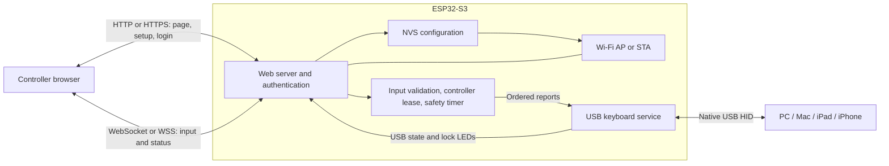

# Wi-Fi USB Remote Keyboard Design Specification

Version: 0.1 | Date: 2026-09-14 | Status: Draft for review

This document specifies the broader proposed product, not a claim that all of
it is implemented. The [keyboard enhancement](keyboard-enhancement-plan.md)
established the iPhone-style US typing page and six-key USB report service with
Shift and Caps Lock feedback. The [Wi-Fi enhancement](wifi-enhancement-plan.md)
now adds AP/STA, mDNS, owner claim/login, and explicit control in an HTTP/WS
development profile. Native and Chromium/WebKit checks and the ESP-IDF v6.1
build pass; device provisioning and the new hardware checks remain pending.
On 2026-09-14 the user confirmed operation of the earlier keyboard-only firmware
with both the separate-image ZIP and merged BIN, recorded as a
[user-reported hardware smoke-test pass](../hardware/README.md#hardware-test-status).
Detailed safety, power, and host/controller compatibility tests remain pending;
the broad acceptance matrix below is not fully signed off. Sender provisioning
writes and physical recovery still require board verification. The computer-key
panel is not added; HTTPS/WSS and encrypted storage remain lower-priority follow-up
work rather than gates for the agreed HTTP/WS increment. The operational profile
below remains a longer-term security target. See the
[development setup guide](development-setup.md) for the verified tools.

## 1. Product Goal

An ESP32-S3 connects by USB to a target computer, tablet, or phone and enumerates
as a standard keyboard. An authorized user opens a keyboard page served by the
board over Wi-Fi. Clicking or touching keys produces USB HID reports, and the
USB host handles them through its normal keyboard driver.

The two roles are distinct:

- **USB host:** Windows PC, Mac, USB-C iPad, or USB-C iPhone receiving keystrokes.
- **Controller:** A device with a browser on the board's Wi-Fi network. It may be
  a different computer, phone, or tablet. The USB host does not need Wi-Fi.

No host agent, browser WebHID access, cloud service, or Internet connection is
required. The browser communicates with the board, not directly with USB.
This is a keyboard, not remote desktop: it cannot see the host's screen, focused
application, clipboard, or text produced by other input devices.

### Requirements

| ID | Required behavior | Acceptance |
| --- | --- | --- |
| REQ-01 | Enumerate over native USB as an HID keyboard on the target host platforms. | AT-01, AT-02 |
| REQ-02 | Allow Wi-Fi configuration and standalone access-point operation. | AT-03, AT-04 |
| REQ-03 | Host a web server reachable through the selected Wi-Fi mode. | AT-03, AT-05 |
| REQ-04 | Serve a keyboard page usable with the controller's physical keyboard, mouse, and touch. | AT-05, AT-06 |
| REQ-05 | Translate authorized browser key actions into ordered USB keyboard press and release reports. | AT-02, AT-07, AT-08 |

The word **must** defines a requirement. Timing and capacity values below are
initial design targets to validate, not measured performance claims.

### Initial Scope

Version 1 provides one USB host, one active browser controller, a US ANSI keyboard
layout, modifiers, navigation keys, and F1-F12. Standalone AP and configured
station modes are both included. Authentication and stuck-key protection are
part of the initial implementation, not optional additions.

Mouse emulation, BLE HID, USB networking, screen streaming, macros, arbitrary
text/Unicode injection, voice input and dictation, clipboard transfer,
media/system-control reports, Internet remote access, OTA updates, and multi-host
switching are out of scope.

## 2. Architecture



### Implementation Choices

| Area | Proposed choice |
| --- | --- |
| Firmware | C and ESP-IDF v6.1; FreeRTOS tasks, queues, and event notifications |
| USB | Espressif `esp_tinyusb` managed component, using TinyUSB's HID implementation |
| Network | `esp_wifi`, `esp_netif`, `esp_event`; IPv4 DHCP and optional mDNS discovery |
| Web | `esp_http_server`; `esp_https_server` for the operational TLS profile |
| Input transport | Same-origin WebSocket with `CONFIG_HTTPD_WS_SUPPORT` enabled |
| Serialization | Bounded JSON parsed with cJSON; no ad hoc string parsing |
| Browser | Small static HTML/CSS/JavaScript application, no runtime framework or CDN |
| Persistence | Versioned NVS configuration; no persistence of keys or input messages |

Pin compatible managed-component versions after the USB bring-up build and
commit their generated dependency lock. Declare cJSON and mDNS dependencies as
required by ESP-IDF v6.1. Do not follow unpinned library branches.

### Code Ownership

| Planned location | Responsibility |
| --- | --- |
| `main/` | Initialize services and coordinate startup/shutdown |
| `components/board/` | Verified pins, physical recovery/control button, status indicator |
| `components/usb_keyboard/` | HID descriptors, USB lifecycle, report submission, host LED output |
| `components/input_router/` | Controller ownership, validated key state, ordering, safety deadlines |
| `components/network/` | AP/STA lifecycle, credential persistence, provisioning transitions |
| `components/web_server/` | HTTP routes, login/session handling, WebSocket parsing and status |
| `components/web_server/www/` | Embedded keyboard page, styles, scripts, and local assets |

These are proposed additions, not folders to populate with empty implementations.
Each component should keep its public headers and focused tests nearby.

## 3. Hardware and USB Contract

The reported board name is ESP32-S3 Nano, manufacturer unknown. USB support is
assumed for design, as requested. Physical validation is still a release gate.

| Item | Contract |
| --- | --- |
| USB role | ESP32-S3 is the USB device; the connected PC/tablet/phone is the host |
| Wiring | Connector data lines reach native USB D- on GPIO19 and D+ on GPIO20 |
| Connector | Data-capable USB-C cable and correct board USB-C device-role circuitry |
| Speed | ESP32-S3 native USB full speed; keyboard throughput does not require high speed |
| Interface | One HID boot-keyboard interface in the normal firmware |
| Input report | 8 bytes: modifier bitmap, reserved zero byte, six non-modifier usages |
| Usage mapping | USB HID Keyboard/Keypad page `0x07`, with an explicit supported-key allowlist |
| Control/output | Handle boot/report protocol, idle requests, and Caps/Num/Scroll Lock LED output through TinyUSB |
| Identification | Stable product and serial strings; use an authorized VID/PID before distribution |

A USB-to-UART bridge cannot implement this USB keyboard interface. Merely having
a USB-C socket is insufficient. Do not assign GPIO19/20 to other peripherals.

The first descriptor should use the same 8-byte layout in boot and report modes,
without a report ID. Support six simultaneous non-modifier keys plus the eight
modifier bits. Reject an over-capacity browser state before emitting a partial
chord; clear input and require the controller to re-arm rather than silently
dropping the seventh key. Exclude reserved/error usages and vendor/system-power
commands. USB protocol fields come from TinyUSB's definitions, not ASCII values.

USB-C iPads and iPhones are compatibility targets, not a guarantee for every
model or OS. Validate accessory permissions, locked-device behavior, cable role,
and available power on real devices. Lightning hosts require a suitable USB
host adapter and separate validation, and are outside the initial direct-USB-C
claim. macOS may request keyboard identification or layout selection. Do not
promise to bypass host security restrictions or support every OS shortcut.

### Power, Debugging, and Recovery

- Treat the device as USB bus-powered initially. Measure total current including
  Wi-Fi peaks and board peripherals; USB power descriptors and pre-configuration
  behavior must match the actual power budget. Do not claim compliance from a
  successful desktop test alone.
- On USB suspend, disarm input. For bus power, meet suspend-current limits even
  if that requires stopping Wi-Fi; reconnect the controller after resume.
  Remote wakeup is disabled in version 1. A self-powered design needs proper
  VBUS detection and must not backfeed the USB host.
- USB OTG HID and fixed-function USB Serial/JTAG share the S3's internal PHY.
  Do not depend on native Serial/JTAG remaining available while HID is running.
- Keep a tested ROM download/recovery procedure. Prefer a separate UART bridge
  for development logs, or evaluate a development-only TinyUSB HID+CDC composite
  configuration. CDC console support is not USB-JTAG.
- Do not burn eFuses or change security/debug fuses as part of bring-up.
- Runtime USB is connected to the target host directly. Windows App and WSL USB
  forwarding are development arrangements, not dependencies of this product.

## 4. Wi-Fi Modes and Provisioning

The [Wi-Fi enhancement plan](wifi-enhancement-plan.md) defines the next
implementation increment, including the preferred `kb.local` name in AP and STA
modes, temporary AP+STA recovery, and pending validation gates.

Support 2.4 GHz WPA2-Personal networks initially. WPA3-Personal can be enabled
after compatibility tests; enterprise Wi-Fi, open networks, and upstream captive
portals are outside version 1. Select the correct regulatory country/channel
configuration rather than hard-coding unrestricted channels.

| State | Behavior and exit condition |
| --- | --- |
| Initial setup | Start a password-protected setup AP when no station credentials exist. If per-device setup secrets have not been provisioned, remain in local service mode rather than opening an unsecured AP. |
| AP operation | User explicitly keeps standalone AP mode. Serve setup and keyboard pages at the AP address; no router or Internet needed. |
| STA connecting | Try the saved network with bounded backoff for up to 30 seconds; input is disarmed until network and USB are ready. |
| STA operation | Use DHCP, serve the keyboard on the LAN, and prefer `kb.local`; handle name conflicts and display the effective hostname. |
| STA recovery | On sustained loss, revoke control and retry. After the connection deadline, offer the protected recovery AP without deleting known-good credentials. |
| Credential change | Require owner authentication, disarm, and temporarily use AP+STA to test the candidate network. Commit only after association and a DHCP lease succeed. |

Suggested AP defaults: SSID `WiFiKeyboard-<device-id>`, address `192.168.4.1`,
DHCP server, and at most four associated stations. Use a non-overlapping AP subnet
if a temporary AP+STA transition would otherwise collide with the upstream LAN.
The device is not an Internet router and does not bridge/NAT the two networks.

### Setup Journey

1. Connect USB and join the board's protected AP using its per-device setup
   credentials, supplied privately during initial flashing/provisioning.
2. Open the board's address in a full browser and log in as owner.
3. Either keep AP mode or scan/select an SSID and submit its password using an
   authenticated POST. Allow manual entry for hidden SSIDs.
4. Test the candidate configuration without overwriting the previous working
   configuration. Return association, authentication, and DHCP errors separately.
5. On success, report the station address/hostname, allow a short confirmation
   window, then stop the temporary setup AP and reconnect through the LAN.
6. On failure or interrupted save, retain the previous committed configuration
   and allow retry through the protected AP.

Use validated, versioned configuration records and an atomic active-record
switch for credentials. Never repeatedly erase NVS to recover a transient error.
Credential scanning and flash writes occur while input is disarmed.

mDNS is a convenience, not the sole discovery mechanism. Show the assigned IP
during provisioning and allow router DHCP lookup. Guest-network client isolation,
firewalls, and VLAN separation can prevent browser access even when both devices
have Wi-Fi. Phones may warn that the AP has no Internet or leave it; document
joining/staying on that network. A captive portal is optional for setup only;
the keyboard must work in the full browser without a portal popup.

## 5. Security and Controller Ownership

Anyone allowed to send keyboard reports can affect the USB host's focused
application. Treat keyboard access as remote control, not an anonymous demo.
Use only with the host owner's authorization.

### Network Security Profiles

- **Development:** HTTP/WS is permitted only through an explicitly selected
  development profile on a protected, isolated AP or trusted test LAN. Login
  remains mandatory. Do not type real passwords or use sensitive hosts; Wi-Fi
  encryption and application login do not provide end-to-end protection against
  a compromised router or another authorized network participant.
- **Operational:** Use HTTPS/WSS for the page, login, setup, and input. Use
  `esp_https_server` and a per-device certificate/key. Browser certificate trust
  must be provisioned before entering credentials. Do not silently downgrade to
  HTTP or depend on bypassing certificate warnings, especially on mobile Safari.
- Proposed trust model: an owner-managed CA issues a certificate for the stable
  device hostname and AP address; the owner enrolls that CA on controller
  devices through an approved local process. Certificate enrollment and renewal
  are an explicit operational-release gate, not solved by mDNS or the AP password.
- No WAN port forwarding, UPnP exposure, cloud relay, or public USB/IP endpoint.

### Authentication and Sessions

Provision separate, random per-device AP and owner secrets through a private
initial setup process; there must be no universal password in firmware or Git.
Store an owner-password verifier using a salted password KDF from the standard
crypto library. Wi-Fi secrets must remain retrievable for association; use
encrypted NVS for operational credentials after provisioning is validated.

Login creates an opaque random session token in an `HttpOnly`, `SameSite=Strict`
cookie, also `Secure` in the operational profile. Tokens are never placed in URLs
or browser local storage. Use 15-minute idle and 8-hour absolute session limits;
logout, password change, factory reset, and reboot revoke sessions. Use monotonic
device time for session/lease deadlines so NTP is not required for local use.

Validate the request Host against configured device addresses and require the
expected Origin for state-changing requests and WebSocket upgrades. Reject
cross-origin and null-origin control attempts; do not enable wildcard CORS.
Use CSRF tokens for administrative POST/DELETE operations. Validate the session
before upgrading a WebSocket and before processing input. Limit login attempts,
open sockets, message sizes, and allocations; never log secrets or key contents.

An authenticated browser must explicitly select **Take Control**. At most one
WebSocket owns the input lease; another browser receives a busy response and
cannot take over silently. Authentication, control ownership, and USB readiness
are separate states. After disconnect, timeout, USB reset, or disarm, a fresh
explicit acquisition is required. Reconnecting never restores pressed keys.

Provide a physical stop/recovery input through a verified board button or an
added button. A short press revokes control; a deliberate long-press opens
network recovery while disarmed. Factory reset requires a separate confirmed
action and clears saved networks and sessions while retaining the device's
privately supplied recovery identity. Button GPIO and gesture timing remain
board-specific. Unplugging USB is the immediate physical stop.

## 6. HTTP Interface

All API routes use version prefix `/api/v1`. JSON bodies are bounded and schema
validated. Network configuration is owner-only and unavailable while armed.

| Method and path | Purpose | Authorization |
| --- | --- | --- |
| `GET /` and `GET /assets/*` | Serve the keyboard/login application and embedded assets | Public shell, no embedded secrets |
| `POST /api/v1/session` | Verify owner credentials and set session cookie | Rate-limited login; Host/Origin checks |
| `DELETE /api/v1/session` | Log out, revoke lease, and release all keys | Session + CSRF |
| `GET /api/v1/status` | Firmware, Wi-Fi mode/address, USB readiness, lease availability, lock LEDs | Session; no passwords or pressed-key history |
| `POST /api/v1/network/scan` | Start asynchronous Wi-Fi scan | Owner + CSRF, disarmed |
| `POST /api/v1/network` | Test/save STA credentials or select AP mode | Owner + CSRF, disarmed |
| `GET /api/v1/network/job` | Poll the current configuration operation | Owner |
| `POST /api/v1/control/stop` | Priority release and lease revocation, including from another owner session | Owner + CSRF |
| `GET /api/v1/keyboard` | Upgrade to the input/status WebSocket | Session and exact allowed Origin |

Use standard status codes: 400 invalid input, 401 missing/expired login, 403
denied origin/permission, 409 busy/state conflict, 413 oversized body, 429 rate
limit, and 503 USB/service unavailable. A credential-test job returns 202 and
progress rather than blocking the HTTP server until Wi-Fi connects.

Serve a fixed asset allowlist from firmware-embedded, optionally compressed
files; a writable filesystem is unnecessary for version 1. Serve correct MIME
types and a restrictive Content Security Policy with same-origin connections,
no third-party scripts, and framing disabled. Escape SSIDs and other untrusted
strings when displaying them. No analytics, CDN dependencies, or keystroke logs.

## 7. Browser-to-HID Protocol

Use a versioned WebSocket subprotocol `wifi-keyboard.v1`. Send **complete pressed
key states**, not text strings or unpaired single-key notifications. Every
distinct state transition must reach USB in order: replacing a pending key-down
with a newer key-up can lose a short tap.

### Message Contract

| Message | Direction | Meaning |
| --- | --- | --- |
| `acquire` | Browser to device | Request control while authenticated and USB ready |
| `lease` | Device to browser | New random lease ID and heartbeat/timeout limits |
| `state` | Browser to device | Full modifier bitmap and array of non-modifier usage IDs |
| `heartbeat` | Browser to device | Keep the current lease alive, without changing keys |
| `release` | Browser to device | Priority all-keys-up and lease revocation |
| `ack` | Device to browser | Confirm USB transfer completion for state, or liveness for heartbeat |
| `status` / `error` | Device to browser | USB/LED/ownership changes or a bounded error code |

Each message has integer `v: 1` and a recognized `type`. After acquisition,
browser messages also have the current `lease` and monotonically increasing
integer `seq`, starting at 1. Lease IDs are server-generated and bound to the
authenticated socket, not accepted as standalone credentials.

Example transcript: each object below is a separate WebSocket message; the
surrounding array is only a documentation format. Usage 4 is the A key, and
modifier value 2 is Left Shift. The host decides which character this produces.

```json
[
    {"v": 1, "type": "acquire"},
    {"v": 1, "type": "lease", "lease": "example-lease", "heartbeat_ms": 250, "timeout_ms": 1000},
    {"v": 1, "type": "state", "lease": "example-lease", "seq": 1, "modifiers": 2, "keys": [4]},
    {"v": 1, "type": "ack", "seq": 1, "result": "usb_sent"},
    {"v": 1, "type": "state", "lease": "example-lease", "seq": 2, "modifiers": 0, "keys": []},
    {"v": 1, "type": "ack", "seq": 2, "result": "usb_sent"},
    {"v": 1, "type": "heartbeat", "lease": "example-lease", "seq": 3},
    {"v": 1, "type": "ack", "seq": 3, "result": "alive"},
    {"v": 1, "type": "release", "lease": "example-lease", "seq": 4}
]
```

`modifiers` is an integer 0-255; bits 0-7 correspond to left Ctrl, Shift, Alt,
GUI, then right Ctrl, Shift, Alt, GUI. GUI is labeled Win or Command in the UI.
`keys` contains zero to six distinct allowed keyboard usages, excluding
modifiers; an empty array with zero modifiers means all keys released.

### Ordering, Delivery, and Limits

- Validate authentication, lease ownership, types, ranges, supported keys, and
  sequence before enqueueing a fixed-size internal report. Do not forward raw
  JSON or arbitrary bytes to TinyUSB.
- WebSocket/TCP provides transport ordering, but the application still checks
  sequence numbers. Ignore exact duplicates without re-emitting them; a changed
  payload with a reused sequence or a sequence gap faults the owning connection.
  Old leases can never refresh timers or enqueue reports.
- Maintain an ordered FIFO with at most 32 report transitions. Do not coalesce
  distinct states. Identical states need no new transfer, but must not bypass an
  earlier pending transition. Each transfer waits for HID endpoint readiness and
  completion before advancing to the next report.
- A state acknowledgement is sent after USB transfer completion, not merely
  enqueueing. For an identical state, acknowledge only when the corresponding
  prior transfer is complete. `usb_sent` does not prove an application displayed
  a character: focus, layout, locks, and OS handling are outside device control.
- Suggested HID polling interval is 10 ms. Bound individual WS messages to
  512 bytes, validate fragmentation with a bounded total message size, and reject
  unsupported binary messages. Use a ceiling of 200 messages/second with a
  bounded burst; this is a defensive limit, not guaranteed typing throughput.
- Limit the browser's outstanding state transitions to 16. On excessive socket
  buffering, queue overflow, a report older than 250 ms, or a USB transfer stall,
  disarm instead of replaying delayed keys or dropping arbitrary transitions.
- No offline queue, persistent input history, automatic resend on reconnect, or
  automatic host commands on plug-in. A lost acknowledgement never causes the
  browser to blindly resend a key press as a new action.

## 8. Key Safety and Task Model

The input router owns the lease and desired report state. One serialized USB
keyboard worker submits reports. TinyUSB's servicing task remains independent
of HTTP requests; HTTP handlers validate and enqueue without waiting for USB.

Send browser heartbeats every 250 ms while the keyboard is visible and armed.
Only fresh valid messages from the owner renew the lease. If none arrives for
1,000 ms, revoke control, invalidate queued reports, and request an all-zero
report. TCP keepalive alone is too slow for this purpose.

Use a monotonic, independently serviced safety deadline. A generation counter
invalidates queued reports on revocation, so a late callback or reused socket
descriptor cannot restore an old key state. Recheck generation and USB readiness
immediately before submission. Priority release must not require a free slot in
the normal FIFO, a functioning HTTP task, or a network acknowledgement.

| Event | Required action |
| --- | --- |
| Owner closes WS, logs out, loses Wi-Fi, or changes network | Revoke lease, discard queued states, send all-zero report |
| Browser loses focus, receives `pointercancel`, hides, or navigates away | Clear browser state and send a best-effort release; server timeout remains authoritative |
| USB unplug, reset, or suspend | Clear internal keys and revoke lease; do not accept input for later delivery |
| USB re-enumeration or resume | Send all-zero report before accepting a fresh control lease |
| Owner sends malformed input or exceeds capacity | Reject, release, and disarm; errors from a non-owner must not mutate the owner's keys |
| Queue/USB processing stalls | Invalidate pending work and prioritize release; expose an unavailable state |
| Any nonzero state remains continuously held for 30 seconds | Release and disarm even if heartbeats continue; require explicit re-acquisition |
| Physical stop or authenticated stop endpoint | Release immediately and revoke the current lease |

If USB is disconnected or suspended, the device cannot guarantee delivery of a
release report to the host. It must clear local state and make all-zero the
first report on recovery. The host owns its behavior while disconnected.

Dispatch outbound WS notifications through the HTTP server's supported work
queue/context; its general APIs are not thread-safe. Slow clients must not block
the USB worker or the safety timer. Network and USB callbacks must not perform
credential writes, Wi-Fi scans, or unbounded allocations.

## 9. Browser Keyboard Behavior

- Show a functional keyboard as the main view after login, with separate Wi-Fi
  settings, USB status, connection status, control ownership, and lock indicators.
  Disable input unless authenticated, explicitly armed, and USB ready.
- Provide letters, digits, punctuation, space, Enter, Tab, Backspace, Escape,
  modifiers, arrows, navigation/editing keys, and F1-F12. Expose all these on
  desktop and mobile; compact tabs for keys/navigation can prevent tiny keycaps.
- Use semantic buttons, accessible labels and focus states, and touch targets of
  at least 44 by 44 CSS pixels. Keep rows stable on resize and avoid overlapping
  text or controls in phone portrait and landscape orientations.
- Use Pointer Events and pointer capture for mouse/touch press and release.
  Restrict touch-action suppression to the keyboard surface. Do not emit both
  pointer events and a duplicate synthetic click for the same action.
- Support held keys and multi-touch chords. Provide one-shot modifier latching
  so a mouse user can select Shift/Ctrl/Alt/GUI before another key; clear those
  latches after the chord, cancellation, disconnect, or disarm. Keep Caps Lock
  distinct from a latched Shift key.
- Host auto-repeat handles a held key; the browser must not also send repeated
  press/release pulses for that same hold.
- Derive lock indicators from host LED output reports; an input acknowledgement
  is not confirmation of Caps Lock state. If no LED report has arrived, show
  unknown rather than claiming synchronization.
- US ANSI is the initial mapping. The USB host's layout determines characters;
  a UI Mac/Windows label preference does not detect or change host layout.
  Accents, IMEs, and arbitrary Unicode are not supported by sending text values.
- Support the controller's physical keyboard while the authenticated keyboard
  view is armed and focused. Track `keydown` and `keyup` by `KeyboardEvent.code`
  through the same US ANSI usage allowlist as the on-screen keys. Ignore repeated
  `keydown` events so host auto-repeat remains authoritative. Do not capture keys
  from form controls or settings/password fields, and do not promise delivery of
  browser/OS-reserved shortcuts. Clear all input state on `blur`,
  `visibilitychange`, `pagehide`, disarm, and errors.
- Show reconnecting/disarmed/busy states and an always-available release/stop
  command. Reconnection never resumes a previous hold automatically.

### Input-Source And Cancel Layout

Decision recorded 2026-09-14 and implemented in software 2026-09-15: place
Globe at the left and Cancel at the right, adapting their row to the controller
viewport:

| Controller layout | Control placement |
| --- | --- |
| Portrait (phones, tablets, and desktop windows) | Keep `123`/`ABC`, Space, and Return in their keycap row. Put Globe and Cancel in a separate utility strip below it. |
| Landscape | Move both controls inline with the Space row: Globe, `123`/`ABC`, Space, Return, Cancel. Do not retain an empty utility strip below it. |

Choose the responsive layout from the controller's available viewport dimensions,
independently of the USB host shortcut profile. Keep both controls available on
letters, numbers, and symbols pages. Respect bottom and side safe-area insets and
provide at least 44-by-44 CSS-pixel hit targets in both orientations. Use locally
embedded Lucide icons with accessible labels and hover tooltips; do not shrink
the typing keys below their existing minimum sizes to fit these controls.

The [historical iPhone X landscape reference](https://forums.macrumors.com/threads/iphone-x-landscape-keyboard.2068622/)
illustrates the inline arrangement. Apple's [keyboard settings guide](https://support.apple.com/guide/iphone/adjust-keyboard-settings-ipha7c3927eb/ios)
also documents landscape typing in supported apps, but does not specify each
control's position. These references are not a current-iPhone hardware test;
compare exact placement with a named iPhone/iOS version at the real-device UI gate.

Voice input and dictation are excluded, not deferred for an experiment. The
Cancel control replaces the proposed microphone position; no microphone button,
microphone permission, speech service, or transcript-to-HID pipeline is planned.

The globe switches the USB host's input source; it does not switch the web
keyboard's visible layout. The controller uses a user-configurable host type,
defaulting to iOS (iPhone/iPad). This is a product default, not a detected host
identity. Standard keyboard HID has no reliable host-OS query, and the current
host output report only carries keyboard LED state. USB device
descriptors identify this keyboard, not the computer it is plugged into.
Browser properties such as `navigator.userAgent` or `navigator.platform` describe
the controller, which may be an iPhone controlling a Windows USB host; they must
not select the host shortcut. The host's active input source is also unknown.

Agreed 2026-09-14: offer only iOS and Windows host profiles in this increment,
with iOS selected by default. Linux, macOS, and custom profiles are deferred.
This limits Globe's host profiles, not the controller browsers or the broader
USB-host compatibility roadmap.

| Host type | Globe command | Notes |
| --- | --- | --- |
| iOS (iPhone/iPad), default | Left Control+Space | Covers iOS/iPadOS external-keyboard input-source switching; verify on each target device and OS version. |
| Windows | Left GUI+Space | Uses the left Windows-key modifier and Space; verify that host policy has not changed or disabled the shortcut. |

Use TinyUSB's `KEYBOARD_MODIFIER_LEFTCTRL` (`0x01`) for iOS and
`KEYBOARD_MODIFIER_LEFTGUI` (`0x08`) for Windows, with no other modifier bits.
Both chords contain only `HID_KEY_SPACE` (`0x2C`); the following all-keys-up
report has zero modifiers and no keys. Use these exact states in report tests.

On first use with no saved preference, preselect iOS without a mandatory host
selection dialog. An iOS/Win segmented toggle exposes the configured profile;
unsupported saved values leave both segments unselected until the user chooses one.
A Globe tap sends its preset when the normal control and USB
readiness gates permit input. Keep the host-type setting editable and retain a
saved selection across reloads and reconnects rather than resetting it to iOS.
Loading the page or changing the host setting must never send a chord. A profile
change clears held input and one-shot Shift, sending only a neutral release if
needed. It never completes a pending gesture from the old profile. An invalid
or unsupported saved profile disables the host-dependent Globe and on-screen
Shift actions until a valid selection is made, without falling back to iOS.
Ordinary typing and physical Shift remain available because their mappings do
not depend on Host. A remembered host type is a user preference and must
be updated when the board moves to a different host type. USB-enumeration
fingerprinting is heuristic and is not part of this design.

The code cannot determine the host's current input language, installed language
list, or active IME from keyboard HID. For Globe, host type selects the shortcut
to send, not a language. The Windows profile also defines the on-screen Shift
gestures in [Typing Behavior](keyboard-enhancement-plan.md#typing-behavior).
Keep Globe stateless: do not track an assumed language,
toggle an English/Chinese label, count taps to predict the host's input source,
or change the visible key map after a switch request. The host may change its
input source independently, and its shortcuts may be customized or unavailable.
Browser locale properties such as `navigator.language` describe the controller,
not the USB host. Caps Lock LEDs and queued acknowledgements are not language
feedback. The host alone interprets the HID key positions into text.

Use `Key map: US ANSI` for the layout label rather than presenting `English (US)`
as the active host language. A host-type setting may show the configured profile,
but do not display a confirmed active-language indicator or language-switch
success state. Implementation tests must cover the fresh iOS default, a retained
Windows override, rejected unsupported profiles, and no inferred language or
key-map change after Globe, status updates, or reconnection.

Invoking the globe must first cancel pointer and physical holds and establish a
neutral report. It then sends the configured shortcut as an ordered chord-down
and all-keys-up pair. A disconnect, timeout, or send failure still prioritizes a
neutral report. The current implemented modifier allowlist accepts only left and
right Shift, so this feature requires narrowly adding Left Control and Left GUI
and testing that physical browser shortcuts remain excluded. A queued
acknowledgement does not prove that the host changed languages, and the UI must
not claim to know the host's active language. The US-ANSI key map remains unchanged
regardless of the language selected by the host.

The Cancel control is intended to reject an unwanted autocorrection or dismiss
a pending suggestion on an iPhone/iPad acting as the USB host. It does not act on
the controller's native keyboard or change its autocorrection settings. The
proposed action is an unmodified Escape tap (Keyboard/Keypad page `0x07`, usage
`0x29`), represented by a Lucide `x` icon with the label `Cancel (Escape)`.
Escape's effect on autocorrection is a real-host validation question, not a
confirmed cross-version iOS/iPadOS behavior.

Keep these cases distinct:

- **Pending suggestion:** verify whether Escape dismisses it and preserves the
  original spelling when Space or Return is subsequently pressed.
- **Already-applied correction:** Escape is not a guaranteed undo operation.
  Apple's onscreen-keyboard guides describe tapping the corrected, underlined
  word and selecting the original spelling. This keyboard-only USB interface
  cannot perform that touch action or inspect the host's text. Do not silently
  substitute Command+Z or a Backspace sequence; either could undo or delete
  unrelated input. A reliable remote revert would need a separately verified
  host-specific action before it can be promised.
- **No suggestion:** the host may interpret Escape as dismissing a menu, dialog,
  or another app action. The browser cannot detect this context or confirm that
  a correction was cancelled; do not present a success indicator for that claim.

Cancel is distinct from Release All Keys: it sends a host key action, does not
close the controller page or disconnect, and does not disable autocorrection
globally. Clear held inputs and one-shot modifiers and establish a neutral
report before sending exactly one Escape-down/all-keys-up pair per activation.
Do not carry Shift or the globe's Control/GUI modifiers into Escape, repeat it
while held, or replay it after reconnection. Existing disconnect, timeout, and
priority-release behavior still applies.

The pre-increment typing allowlist excluded Escape. The implementation adds only
solitary unmodified Escape to the on-screen command path, firmware validation,
and preview mock, with focused model/parser/report tests; the full-state protocol
shape and USB descriptor do not change. This on-screen action does not authorize
forwarding physical browser shortcuts or add a computer-key panel.

Gate: check single activation, modifier isolation, release ordering, cancellation,
and reconnect behavior in the existing tests, then validate the controls' separate
portrait strip and inline landscape row on all supported viewports and build the
firmware. Check rotation in both directions on every keyboard page, with safe
areas and held input: clear holds and one-shot modifiers during rearrangement,
preserve the selected keyboard page and host shortcut profile, and never generate
a Globe or Escape action merely from rotation. Verify one accessible instance of
each control, minimum touch targets, and no overlapping or clipped keys.
On named real iPhone/iPad hosts, separately test a pending suggestion, an applied
correction, and no suggestion in Notes and a Safari text field. Record OS version,
input language, and hardware-keyboard autocorrection settings. These checks are
pending; a browser mock or firmware build cannot establish autocorrection support.

Software gate recorded 2026-09-15: all ten ASan/UBSan native suites and 15
keyboard-model tests pass. All 34 API/browser tests pass across Chromium and
WebKit. Chromium covers invalid-profile blocking, keyboard accessibility,
persistence/reconnect silence, every-page rotation cleanup, responsive placement,
and safe areas, with exact commands exercised through touch, mouse, and keyboard.
WebKit delivers the exact iOS/Windows Globe and isolated Escape reports through
touch. Both engines load the local icons, and physical shortcuts remain excluded.
After integrating compiler size optimization from main, fresh ESP-IDF v6.1
builds pass at `0xe19d0` bytes with `0x1e630` bytes free (about 12%) for the
generic LED-disabled profile, and `0xe2ea0` bytes with `0x1d160` bytes free
(about 11%) for the XinluCity status-LED profile. Both retain the unchanged
1 MiB application partition and explicitly verify `COMPILER_OPTIMIZATION_SIZE`.
The earlier `0xF63E0`/`0x9C20` measurement was a debug-optimized generic build.
The real-host checks above remain pending, and headroom below the 20% product
goal is not an operational-release signoff.

## 10. Storage and Resource Budgets

Store only Wi-Fi mode/credentials, owner verifier, device identity, TLS material,
and small UI preferences in versioned configuration. Hold sessions, leases,
pressed keys, and report queues only in RAM. Logs contain lifecycle/error codes,
not key payloads, passwords, tokens, or TLS private keys.

Embed web assets in the firmware image so the firmware and protocol/UI versions
update together. An initial compressed asset budget of 200 KiB avoids needing
external storage. PSRAM must not be assumed or required by the core keyboard
path. Bound concurrent TLS handshakes and HTTP requests; initially allow two
authenticated WS clients, of which one can own input.

Do not adopt the starter's default partition size as a product specification.
Measure flash usage, minimum free internal heap, largest free block, task stack
high-water marks, and USB power during an authenticated session. Require at
least 20% application-partition headroom and target 64 KiB minimum free internal
heap under tested load. Choose the final partition table after confirming actual
flash capacity. OTA slots and writable web-asset partitions are not required now.

## 11. Verification and Acceptance

| Test | Pass criterion |
| --- | --- |
| AT-01: USB hosts | Enumerate as a keyboard on a named Windows PC, Mac, USB-C iPad, and USB-C iPhone; record exact hardware/OS, cable, permissions, and power setup. No custom host agent. |
| AT-02: Key mapping | In a consenting test host's text editor, verify every supported key, modifiers, repeated letters, holds, chords, and lock feedback for the selected layout. |
| AT-03: AP operation | With no router/Internet, an authorized controller joins the protected AP, loads all assets, logs in, acquires control, and sends keys. |
| AT-04: Provisioning | Correct/wrong passwords, hidden SSID, DHCP failure, loss of Wi-Fi, mode changes, power loss during save, and recovery preserve a reachable, protected configuration. |
| AT-05: Browser reachability | Serve the page in STA and AP modes; verify numeric-address fallback and expected failure under LAN client isolation. No external asset requests. |
| AT-06: Browser input | Desktop Chrome/Edge and macOS Safari: physical-key press/release, holds, chords, host repeat, focus-loss release, and form-field isolation. Those browsers plus iOS/iPadOS Safari and Android Chrome: mouse, touch, pointer cancellation, rotation, modifier latches, and accessible controls. |
| AT-07: Ordering | At least 1,000 rapid taps/chords with a USB report capture show no missing release, duplicate tap, or reordered transition under normal LAN load. |
| AT-08: Safety | Lose browser/network while holding a modifier: all-zero report is submitted within 1,100 ms of the last valid message while USB remains responsive. Test the 30-second hold ceiling, unplug/suspend/resume, queue overflow, and stale leases. |
| AT-09: Authorization | Anonymous input/config writes, cross-origin requests, CSRF, session expiry, brute-force bursts, and second-controller acquisition cannot inject keys. |
| AT-10: Protocol robustness | Reject oversized, fragmented-over-limit, malformed, duplicate-conflicting, out-of-range, unsupported, and over-six-key messages without crashes or stale input. |
| AT-11: Performance | On a stable local WLAN, target p95 browser action to USB-transfer acknowledgement at or below 100 ms; record conditions separately from host text-render latency. |
| AT-12: Endurance | Eight-hour session with repeated connections and Wi-Fi disruptions shows no growing heap use, stuck keys, or watchdog resets; meet resource and power budgets. |
| AT-13: Operational TLS | Trusted HTTPS/WSS works on every supported controller platform, with no downgrade or certificate bypass; secrets are absent from logs and assets. |
| AT-14: Recovery | A bad image/configuration can be recovered through the documented physical/ROM procedure without depending on working HID, Wi-Fi, or remote USB redirection. |

Use unit tests for the router's sequence/lease/key-state logic and configuration
validation, USB-service fakes for queue/deadline cases, and browser automation for
pointer/state behavior and responsive screenshots. Use actual USB hosts for
enumeration, report capture, suspend, power, and iPhone/iPad compatibility. A
successful firmware build or browser mock alone cannot satisfy those tests.

The safety and authentication tests are required before testing on a sensitive
host. Operational release additionally requires TLS trust, credential storage,
authorized USB identifiers, and the real-host compatibility matrix.

## 12. Implementation Milestones

1. **USB bring-up:** Pin `esp_tinyusb`, implement keyboard-only descriptors and
   manually triggered test input, and prove press/release on one desktop host.
   Confirm power, native USB wiring, and a recovery/logging path. Do not copy
   an example's automatic typing-on-connect behavior into the product.
2. **Protected AP and web shell:** Provide unique setup credentials, login,
   embedded assets, and status. USB remains all-keys-up until explicit control.
3. **Input pipeline:** Implement leases, bounded state messages, ordered USB
   reports, heartbeats, priority release, and the pointer-driven keyboard.
   Pass ordering, authorization, and failure tests before expanding features.
4. **Station provisioning:** Add scan/manual SSID, candidate configuration tests,
   atomic saves, AP fallback, and discovery; validate transitions while disarmed.
5. **Operational readiness:** Add trusted HTTPS/WSS and encrypted credential
   storage, then validate PC/Mac/iPad/iPhone compatibility, mobile UI, power,
   endurance, and recovery. Freeze component versions and board configuration.

Each milestone must produce a buildable increment. Keep existing setup and
hardware notes updated with measured results; do not mark proposed checks passed.

## 13. Assumptions and Open Decisions

- USB-C host-capable iPhones/iPads are the initial mobile target. Actual models
  and OS versions still need selection for the compatibility matrix.
- The board has a usable native USB data connection. Its vendor, flash/PSRAM,
  power circuitry, and recovery button/UART must be confirmed before flashing
  a board-specific HID image, not before reviewing this design.
- One controller, US ANSI mapping, and explicit arming are the proposed initial
  behavior. The globe is a host input-source command rather than an additional
  layout; its host profile and shortcuts need real-host validation. Additional
  visual layouts and media keys need a separate scope decision.
- The Cancel icon's placement is selected, but whether Escape rejects the desired
  iPhone/iPad autocorrection state requires real-host validation. Reverting an
  already-applied correction is not guaranteed by the proposed Escape action.
- Choose how per-device secrets and the owner CA/certificates are delivered
  privately. Operational network trust must be practical on both desktop and
  Apple mobile browsers; this is not implied by USB compatibility.
- A physical control/recovery button and optional status LED need a verified
  mapping. Do not infer an LED GPIO from the ESP32-S3 Nano name.

## 14. References

- [Espressif USB Device Stack: HID, wiring, and shared PHY](https://docs.espressif.com/projects/esp-usb/en/latest/esp32s3/usb_device.html)
- [ESP-IDF v6.1 TinyUSB HID Example](https://github.com/espressif/esp-idf/tree/v6.1/examples/peripherals/usb/device/tusb_hid)
- [ESP-IDF v6.1 HTTP Server and WebSocket APIs](https://docs.espressif.com/projects/esp-idf/en/v6.1/esp32s3/api-reference/protocols/esp_http_server.html)
- [ESP-IDF v6.1 HTTPS Server](https://docs.espressif.com/projects/esp-idf/en/v6.1/esp32s3/api-reference/protocols/esp_https_server.html)
- [Apple iPhone typing and autocorrection guide](https://support.apple.com/guide/iphone/type-with-the-onscreen-keyboard-iph3c50f96e/ios)
- [Apple iPad typing and autocorrection guide](https://support.apple.com/guide/ipad/type-with-the-onscreen-keyboard-ipad997da459/ipados)
- [Development Setup](development-setup.md)
- [Hardware Identification Checklist](../hardware/README.md)

The ESP-USB documentation tracks its latest component release. Confirm APIs
against the version actually pinned with ESP-IDF v6.1 during implementation.